<strong>1. Mô tả bài toán</strong> 
 	Bài toán áp dụng cho trung tâm ngoại ngữ Yên Chi
 	Áp dụng vào việc quản lý trung tâm như 
- 	Quản lý giáo viên, tính lương.
-	Quản lý học viên, tính học phí.
-	Giới thiệu, quảng bá trung tâm, các khóa học, tuyển dụng nhân sự.
-	Quản lý khóa học, lịch học.
-	Chức năng theo dõi lịch học, lịch công tác, kết quả của học viên, giáo viên.

<strong>2. Mục đích của bài toán</strong> 
 	**Đầu vào**: 

-Thông tin khách hàng: 
- Học viên
      + Thông tin cá nhân 
      + Trình độ học vấn
      + Khóa học cần đăng kí
-	Giáo viên
      + Thông tin cá nhân
      + Trình độ học vấn
		(Tương tự như Học viên)
 	**Đầu ra:**
-	Thông tin lịch học, lịch giảng dạy của học viên, giáo viên.
-	Tiền học phí, tiền lương của học viên, giáo viên.

<strong>3. Các bước cài đặt và một số công cụ hỗ trợ</strong> 
 	<strong>Các bước cài đặt:</strong>
-	Clone reponsive về máy.
	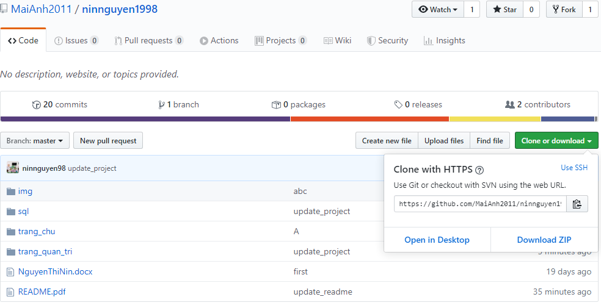
-	Đảm bảo máy đã có Xampp.
	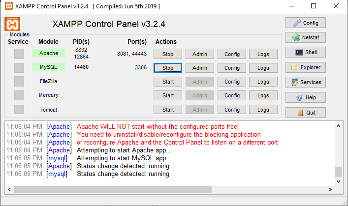
-	Đưa project vừa tải về vào thư mục htdocs trong Xampp.
	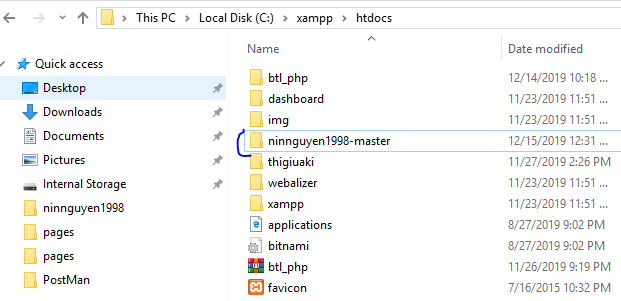
-	Bật Xampp.
-	Qua trình duyệt gõ localhost:/cổng -> trỏ đến thư mục của project
	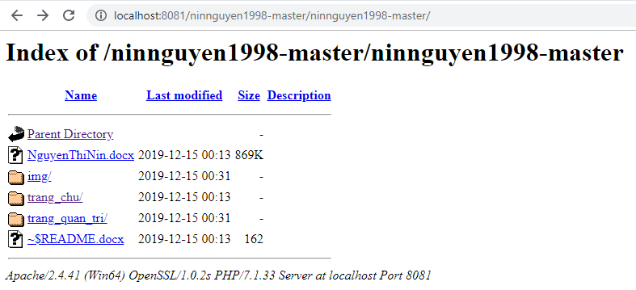
	<strong>Công cụ hỗ trợ: Xampp</strong>
<strong>4. Nội dung bài toán</strong>
	<strong>Các chức năng đã làm được</strong>
- 	Quảng bá trung tâm
	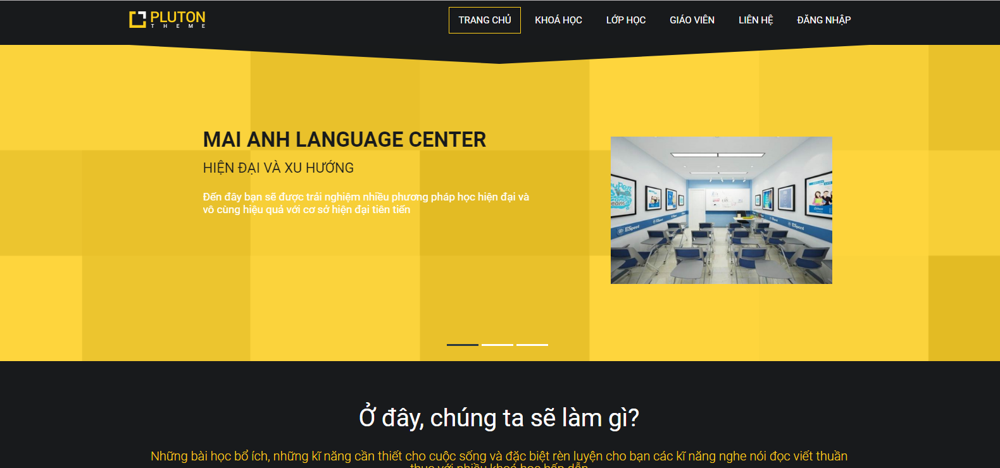
	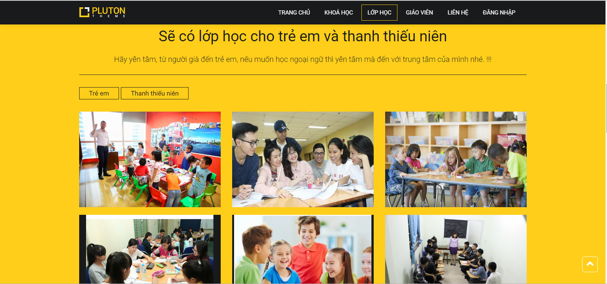
- 	Đăng nhập vào trang admin sử dụng tài khoản (username: abc, pass: 123)
	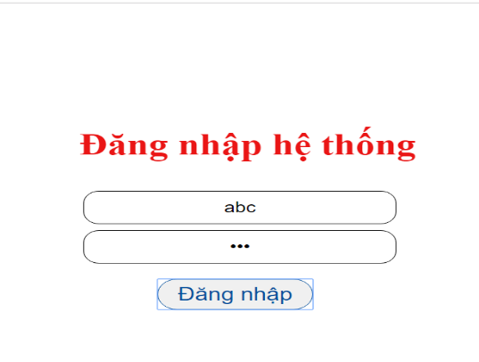
- 	Sau khi đăng nhập thành công sẽ đưa tới trang Admin với giao diện như sau:
	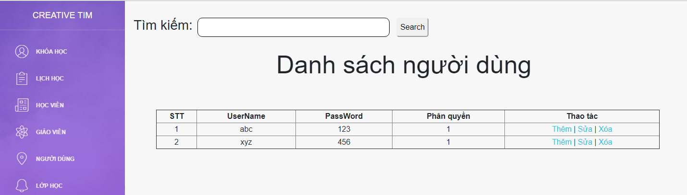
- 	Các chức năng thêm xóa sửa tìm kiếm khóa học, lịch học, học viên, giáo viên....
	+ Chức năng tìm kiếm gần đúng với từ nhập vào
	
	+ Chức năng thêm: (Thao tác trên bảng Người dùng)(phân quyền: 0-user, 1- admin)
	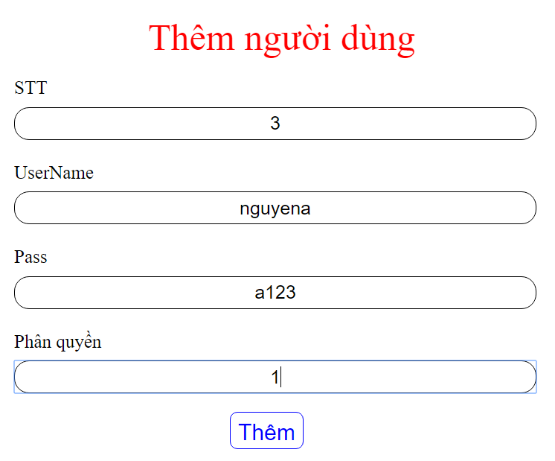
	+ Chức năng sửa:
	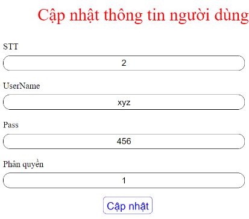
	+ Chức năng xóa 
<strong>5. Hướng phát triển của hệ thống</strong>
-	Gửi thông báo về mail cho từng thành viên trong trung tâm
-	Tính lương theo bảng chấm công
	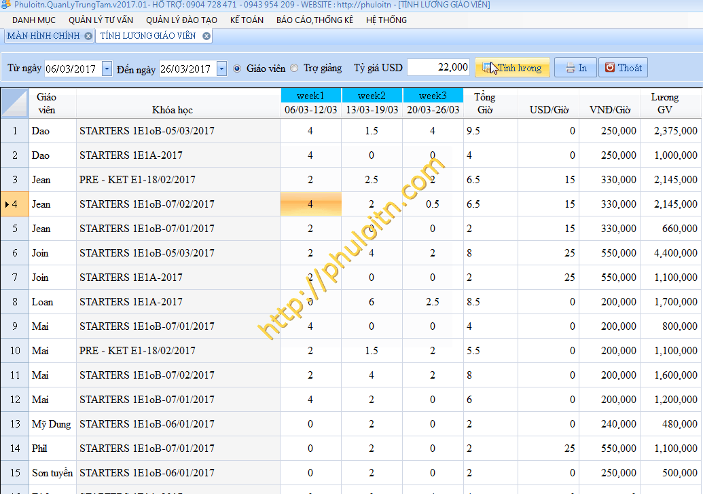